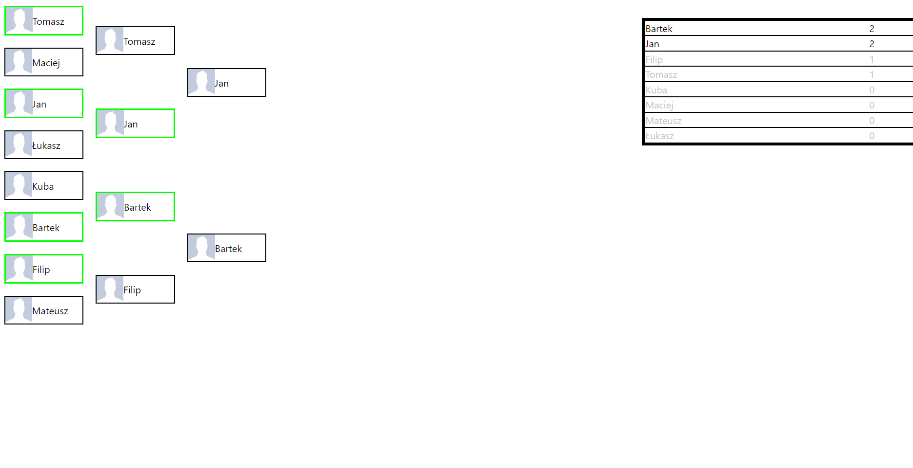
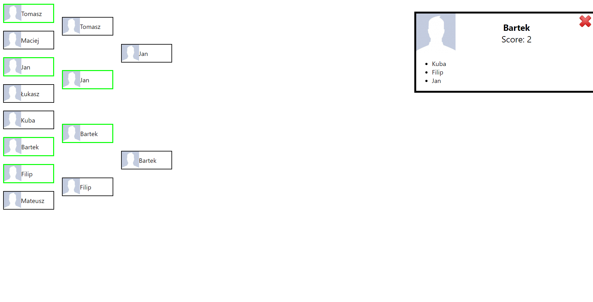

# Tournament Info App
Web application written in React.js that is used to display information about players taking part in a tournament and their results as the competition continues.
It works together with my PlayoffsApp for Android as it uses the same Firebase realtime database.

